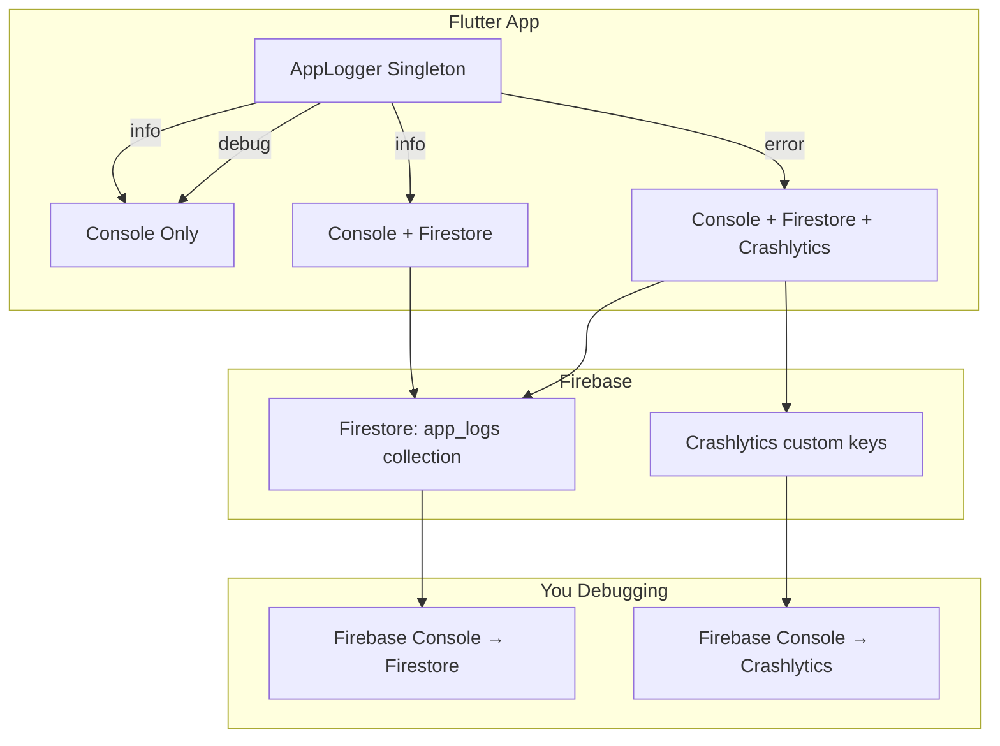

# Structured Centralized Logging for NSAT

Add structured logs with timestamps, user IDs, request IDs, and log levels (debug/info/error) throughout the app. Persist error-level logs to Firestore so you can investigate issues from Firebase Console without relying solely on Crashlytics.

## Architecture Overview



### How it works

1. **`AppLogger`** — a singleton service that every service/provider calls instead of `print()` or `debugPrint()`.
2. **Log levels**: `debug` (dev only, console), `info` (normal ops, console + optional Firestore), `error` (breaks, console + Firestore + Crashlytics).
3. **Structured fields on every log**: ISO timestamp, userId (application_no or "admin"), requestId (UUID per operation), level, tag (class name), message, optional error/stackTrace.
4. **Firestore persistence**: error logs and key info logs get written to `app_logs` collection so you can query them from Firebase Console when something goes wrong.
5. **Crashlytics enrichment**: error logs also set custom keys on Crashlytics for richer crash reports.

---

## User Review Required

> [!IMPORTANT]
> **Firestore cost**: Writing every info log to Firestore will add writes. The plan writes only **error** and **critical info** (login, test start, test submit, OTP) to Firestore. Debug logs are console-only. This keeps writes minimal (maybe 5-10 per student session). Fine for your scale?

> [!IMPORTANT]
> **Log retention**: Firestore logs will accumulate. I recommend adding a TTL Cloud Function later that deletes logs older than 30 days. For now, they stay. OK?

> [!WARNING]
> **No new packages**: I'll use `dart:developer` for console logging and `uuid` for request IDs. The `uuid` package needs to be added to `pubspec.yaml`. Everything else uses existing Firebase SDKs.

---

## Proposed Changes

### Logging Core

#### [NEW] [app_logger.dart](file:///Users/devanshchaubey/Desktop/nsat/lib/services/app_logger.dart)

The centralized logger singleton. Every log call goes through here.

```dart
// Key API:
AppLogger.instance.init(userId: 'NIU2025MBA0472');  // call after login
AppLogger.instance.debug('MyClass', 'Loading questions', requestId: reqId);
AppLogger.instance.info('MyClass', 'Test started', requestId: reqId, persist: true);
AppLogger.instance.error('MyClass', 'Firestore write failed', error: e, stackTrace: st, requestId: reqId);
```

Each log entry is a structured map:
```json
{
  "timestamp": "2026-05-23T17:16:58.123+05:30",
  "level": "error",
  "tag": "ScoringService",
  "message": "scoreSubmission Cloud Function failed",
  "userId": "NIU2025MBA0472",
  "requestId": "a3f8b2c1-...",
  "error": "FirebaseFunctionsException: UNAVAILABLE",
  "stackTrace": "...(first 500 chars)..."
}
```

- **debug**: `dart:developer` log → console only (stripped in release builds via `kDebugMode`)
- **info**: console + optionally persists to Firestore `app_logs` collection
- **error**: console + **always** persists to Firestore + records to Crashlytics with custom keys

---

### Dependency

#### [MODIFY] [pubspec.yaml](file:///Users/devanshchaubey/Desktop/nsat/pubspec.yaml)

Add `uuid: ^4.5.1` under dependencies for generating request IDs.

---

### App Initialization

#### [MODIFY] [main.dart](file:///Users/devanshchaubey/Desktop/nsat/lib/main.dart)

- Import `AppLogger`
- After Firebase init, initialize the logger
- Wrap the `FlutterError.onError` and `PlatformDispatcher.instance.onError` to also log through `AppLogger` (in addition to existing Crashlytics calls)

---

### Service Integration — wiring `AppLogger` into every service

Each service gets a `static const _tag = 'ClassName';` and replaces bare `catch (e)` blocks with structured `AppLogger.instance.error(...)` calls. Key operations get `info` logs.

#### [MODIFY] [auth_service.dart](file:///Users/devanshchaubey/Desktop/nsat/lib/services/auth_service.dart)

- Log `info` on successful login (student + admin)
- Log `error` on failed login with the exception details
- Log `info` on session restore / clear

#### [MODIFY] [attempt_service.dart](file:///Users/devanshchaubey/Desktop/nsat/lib/services/attempt_service.dart)

- Log `info` on attempt started / resumed / already completed
- Log `error` on transaction failure

#### [MODIFY] [scoring_service.dart](file:///Users/devanshchaubey/Desktop/nsat/lib/services/scoring_service.dart)

- Log `info` on successful score submission
- Log `error` on Cloud Function call failure

#### [MODIFY] [question_service.dart](file:///Users/devanshchaubey/Desktop/nsat/lib/services/question_service.dart)

- Log `debug` for question fetch queries
- Log `error` on Firestore read failure

#### [MODIFY] [student_service.dart](file:///Users/devanshchaubey/Desktop/nsat/lib/services/student_service.dart)

- Log `info` for student lookup results
- Log `error` on lookup failure

#### [MODIFY] [fcm_service.dart](file:///Users/devanshchaubey/Desktop/nsat/lib/services/fcm_service.dart)

- Log `info` on topic subscribe/unsubscribe
- Log `error` if permission denied

#### [MODIFY] [remote_config_service.dart](file:///Users/devanshchaubey/Desktop/nsat/lib/services/remote_config_service.dart)

- Log `info` on successful fetch
- Log `error` (currently silently swallowed) on fetch failure

#### [MODIFY] [notification_service.dart](file:///Users/devanshchaubey/Desktop/nsat/lib/services/notification_service.dart)

- Log `info` on notification sent
- Log `error` on send failure

#### [MODIFY] [admin_service.dart](file:///Users/devanshchaubey/Desktop/nsat/lib/services/admin_service.dart)

- Log `info` for dashboard stats fetch
- Log `error` on failure

---

### Provider Integration — set userId on login, log key state transitions

#### [MODIFY] [auth_provider.dart](file:///Users/devanshchaubey/Desktop/nsat/lib/providers/auth_provider.dart)

- After successful login, call `AppLogger.instance.setUserId(...)` so all subsequent logs carry the user's ID
- Log `info` for fee gate outcomes
- Log `error` for fetchLeadDetails failure

#### [MODIFY] [test_provider.dart](file:///Users/devanshchaubey/Desktop/nsat/lib/providers/test_provider.dart)

- Log `info` on test start, test submit
- Log `error` on submission failure (the "tell an invigilator" case)
- Generate a `requestId` for the entire test session lifecycle

#### [MODIFY] [admin_provider.dart](file:///Users/devanshchaubey/Desktop/nsat/lib/providers/admin_provider.dart)

- Log `error` on stats/results fetch failure
- Log `info` on notification send

---

### Firestore Security Rules

#### [MODIFY] [firestore.rules](file:///Users/devanshchaubey/Desktop/nsat/firestore.rules)

Add a rule for `app_logs` collection: allow write from authenticated clients (or all clients since students aren't Firebase-authenticated during some flows), deny read from clients (admin reads via Console only).

---

## How to Check Logs When You Face Issues

### 1. Firebase Console → Firestore → `app_logs` collection

This is your primary debugging tool beyond Crashlytics.

```
Firebase Console → Firestore Database → app_logs
```

**Filter by user**: Click "Filter" → field: `userId`, operator: `==`, value: `NIU2025MBA0472`

**Filter by errors only**: field: `level`, operator: `==`, value: `error`

**Filter by time**: field: `timestamp`, operator: `>=`, value: `2026-05-23T00:00:00`

**Filter by request flow**: field: `requestId`, operator: `==`, value: `<the-uuid>` — this traces an entire operation (e.g., a full test submission) across multiple log entries.

### 2. Firebase Console → Crashlytics

Still your first stop for crashes. Now enriched with:
- Custom key `last_log_tag` — which service class last logged
- Custom key `last_request_id` — trace back to Firestore logs
- Custom key `user_id` — the application number

### 3. Local Development — Console Logs

During development, **all** log levels print to the debug console with colored prefixes:
```
🔍 [DEBUG] [AuthService] [2026-05-23T17:16:58] Loading saved session
ℹ️  [INFO]  [TestProvider] [2026-05-23T17:17:02] [req:a3f8b2c1] Test started for NIU2025MBA0472
🔴 [ERROR] [ScoringService] [2026-05-23T17:45:00] [req:a3f8b2c1] Cloud Function failed: UNAVAILABLE
```

### 4. Quick Debug Checklist

| Issue | Where to look |
|-------|--------------|
| App crashes | Crashlytics → look at custom keys → find `requestId` → search Firestore `app_logs` |
| Student says "test didn't submit" | Firestore `app_logs` → filter `userId == <their NIU ID>` + `level == error` |
| Login not working | Firestore `app_logs` → filter `tag == AuthService` or `tag == AuthProvider` |
| Questions didn't load | Firestore `app_logs` → filter `tag == QuestionService` + `level == error` |
| OTP issues | Firestore `app_logs` → filter `tag == AuthProvider` + message contains "otp" |
| "What happened on exam day?" | Firestore `app_logs` → filter by date range, look at error-level entries |

---

## Verification Plan

### Automated Tests
- Run `flutter analyze` to ensure no lint errors
- Run `flutter build apk --debug` to confirm build passes
- Verify Firestore rules deploy with `firebase deploy --only firestore:rules`

### Manual Verification
- Launch app in debug mode → verify console logs appear with structured format
- Trigger a login → check Firestore `app_logs` for the info entry
- Force an error (e.g., airplane mode during test load) → verify error appears in both console and Firestore `app_logs`
- Check Crashlytics dashboard for enriched custom keys
